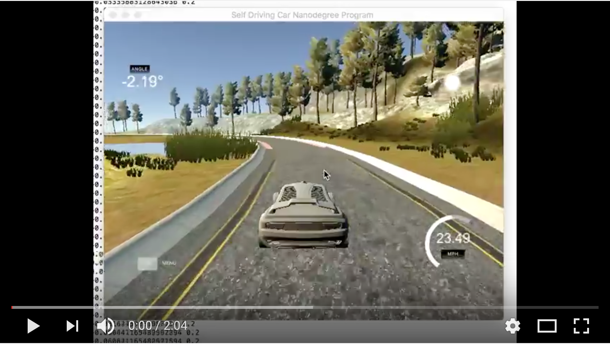
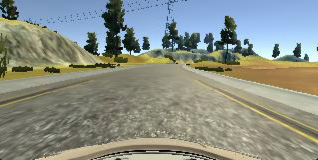
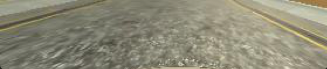
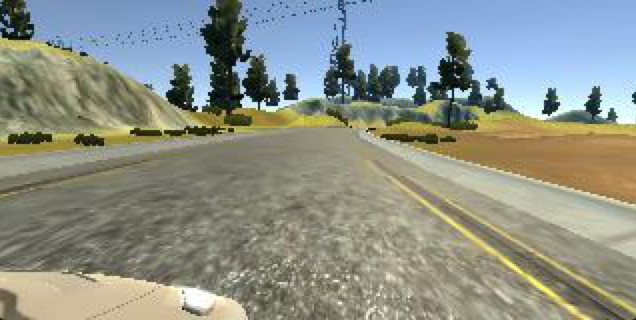

# Driving An Autonomous Car Using Convolutional Neural Networks
**Project 3 of Udacity's Self-Driving Car Engineering Nanodegree**

In this project I build a convolutional neural network (CNN) in Keras to predict the steering angle for an autonomous car.

Here's the final result:  

### Data Collection
The simulator built by Udacity has two modes: "Training" and "Autonomous." In training mode, a human drives the car around the track (in my case using a PS4 controller) and controls the car's steering, throttle, and brake. While the human drives, the simulator continuously takes photos from 3 virtual cameras mounted on the left, right, and center of the car's windshield. In addition, the simulator records the steering, throttle and brake. All of this data is saved into a csv file. 

### Training The Car
To simplify the project, we only trained the car to steer; the throttle will be kept constant. 

#### Augmenting Training Data
Before feeding the images and corresponding steering angles into the neural network, I cropped the image to remove any unnecessary info like the surrounding scenery and car hood. 
  
Original vs. Cropped  

#### Recovery Data
When the car veers to the side of the road, I had to train it to drive back to the center. To do this, I augmented the steering angle by +/- .25 for the images from the left and right cameras. These cameras make it seem like the car is further left or right than it really is. 

Example: center vs. right image (prior to cropping)  

By adjusting the steering angle back towards the the center of the lane, we are training the car to drive back to the middle when it finds itself on the side of the road.

#### Unbiased Data
Since cars normally drive straight and only occasionally turn, the training data is heavily biased towards driving straight. When I trained my model with this unbalanced data, the car only learned to drive straight and wouldn't turn. To fix this, I split the data into 3 bags (left turns, right turns, and straight driving). When feeding data into the network, I made sure I'm feeding it an equal amount from each bag. In addition, I flipped 50% of the images on its vertical axis to generate more turning data points.

#### Feeding data into the neural network
After augmentation and balancing, I had about 25,000 samples. Before training the network, I shuffled the data and split off 20% for validation data. 
Due to physical memory constraints, not all the images can be loaded into memory at once. As such, I used a generator to feed batches of 50 images into the network at once. 
I trained the network in 10 epochs, with each epoch containing 10,000 samples. 

### Convolutional Neural Network Architecture
My neural network is based largely on the architecture outlined in [this publication by engineers at NVIDIA.](https://images.nvidia.com/content/tegra/automotive/images/2016/solutions/pdf/end-to-end-dl-using-px.pdf) I chose this network because it was successfully applied to a very similar problem. 

The network contains 9 layers. Each layer has a ReLU activation function applied to it.
1, 2, 3:  Convolutional: 2x2 stride, 5x5 kernel
4, 5: Convolutional: no stride, 3x3 kernel
6, 7, 8: Fully Connected
9: Fully connected with single output 

To prevent overfitting, I added a 20% dropout between layers 5 and 6 and a 50% dropout between 6 and 7.

When training the network, I used an Adam optimizer with a learning rate of 0.0001. "Mean squared error" is used as the loss function.
